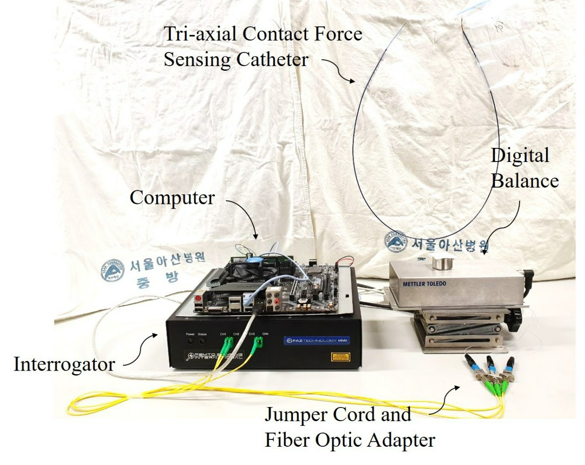

# Smart Catheter
<p align="center">
  
</p>

***Official implementation*** of "Roughly Collected Dataset for Contact Force Sensing Catheter". All property belongs to Asan Medical Center, Asan Institue of Life Sciences, Biomedical Engineering Research Center for Life Sciences.

- Paper: 
- Dataset: 

## Train New Model

If you want to train your own model which is not in our implementations, follow the instructions.

### Create package

First, you need to create a new python package. It is done by copying one of the existing package.
```bash
cp -r models/fcn models/<your-model>
```
Then your task package will have the following structure.
```bash
models/<your-model>
├── __init__.py
├── arguments.py
├── model.py
└── dataset.py
```

### Implement dataset

In `dataset.py`, there is `Dataset` class that is used to fetch crowd-sourcing data. You need to implement `__init__()`, `__len__()`, and `__getitem__()`. While implementing, ***you should not change the signature of the functions***. For each function, there are some requirements you should meet.

- `__len__()` : return the number of data.
- `__getitem__()` : return the data which its index is `idx`, and any shape doesn't matters

If you need additional arguments for dataset, modify `add_dataset_args()`. Additional information is introduced at [argparse](https://docs.python.org/3/library/argparse.html).

### Implement model

In `model.py`, there is `Model` class that is used for predicting contact force from signal data. It is same with other pytorch models, but one restriction exists - the output shape must be `(batch_size, 1)`. Input variable `x` in `forward` function is the data you fetched from `Dataset` instance. As same as `Dataset`, if you want more arguments, modify `add_model_args()`.

### Add to global arguments

After finishing `Dataset` and `Model`, please add your task to `arguments.py`.
```python
# models = ['fcn', 'rnn', 'transformer']
models = ['<your-model>', 'fcn', 'rnn', 'transformer']
```
Now you can train your own model!

## Train

Training is simple. Run `python train.py --model <your-model> -h` to see the arguments and then add them. Because the arguments for each task is different, you should add `--task` option to see help. After adding the arguments, just run the command! Logs will be saved as tensorboard log that you can see on tensorboard.

```bash
> python train.py --model fcn -h
usage: train.py [-h] [--seed SEED] [--epochs EPOCHS] [--batch_size BATCH_SIZE] [--lr LR] [--log_interval LOG_INTERVAL] [--model {fcn,rnn,transformer}] [--train_data TRAIN_DATA] [--valid_data VALID_DATA] [--device {cpu,cuda}] [--save_dir SAVE_DIR] [--log_dir LOG_DIR] [--input_len INPUT_LEN]
                [--n_channel N_CHANNEL] [--n_hid N_HID] [--n_layer N_LAYER] [--dropout DROPOUT]

optional arguments:
  -h, --help            show this help message and exit

train:
  --seed SEED           Random seed.
  --epochs EPOCHS       Number of epochs for training.
  --batch_size BATCH_SIZE
                        Number of instances in a batch.
  --lr LR               Learning rate.
  --log_interval LOG_INTERVAL
                        Log interval.
  --model {fcn,rnn,transformer}
                        Task name for training.
  --train_data TRAIN_DATA
                        Root directory of train data.
  --valid_data VALID_DATA
                        Root directory of validation data.
  --device {cpu,cuda}   Device going to use for training.
  --save_dir SAVE_DIR   Folder going to save model checkpoints.
  --log_dir LOG_DIR     Folder going to save logs.

dataset:
  --input_len INPUT_LEN
                        Lenght of input signal.
  --n_channel N_CHANNEL
                        Number of channels in input signal.

model:
  --n_hid N_HID         Number of units in a FC layer.
  --n_layer N_LAYER     Number of FC layers.
  --dropout DROPOUT     Dropout rate.
```

## Test

With our checkpoint file, you can measure performance on test set. Run `test.py` with your checkpoint file, than you can see the L1 loss and 95% reliability.
```bash
> python test.py -h
usage: test.py [-h] [--batch_size BATCH_SIZE] [--test_data TEST_DATA] [--device {cpu,cuda}] [--ckpt_dir CKPT_DIR]

optional arguments:
  -h, --help            show this help message and exit

test:
  --batch_size BATCH_SIZE
                        Number of instances in a batch.
  --test_data TEST_DATA
                        Root directory of test data.
  --device {cpu,cuda}   Device going to use for training.
  --ckpt_dir CKPT_DIR   Directory which contains the checkpoint and args.json.
```

## Experiments

With several combinations of `# of hidden`, `# of layers` (and `# of heads` for transformer), the following models gain the best performance for test data. We used preprocessed data, not the original data. You can see `preprocess.py` if you're interested in our preprocessing.

- FCN: 2 layers, 64 hidden dimension
- RNN: GRU cell, 4 layers, 64 hidden dimension
- Transformer: 12 heads, 4 layers, 512 hidden dimension

| Model       | FCN   | RNN   | Transformer |
| ----------- | ----- | ----- | ----------- |
| Performance | 3.03g | 2.46g | 3.01g       |

## Citations

TODO
